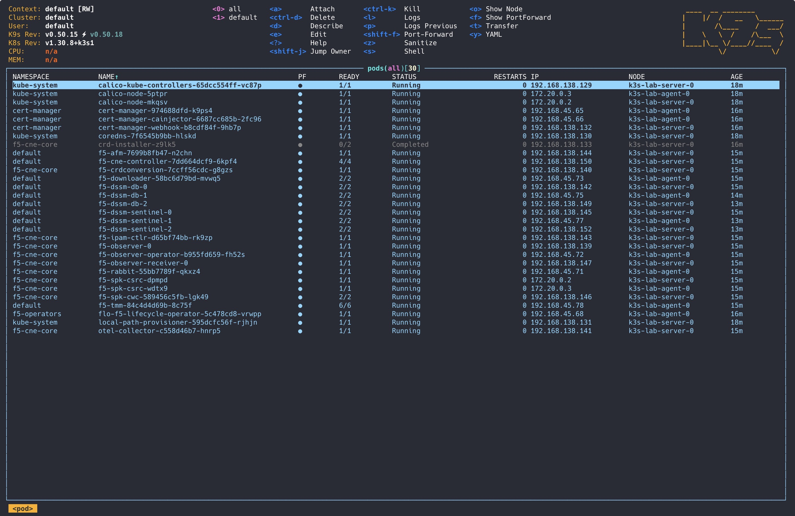
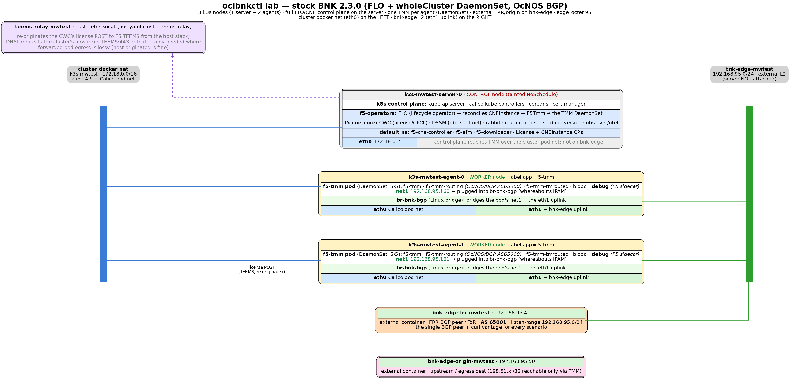

# ocibnkctl


[](https://github.com/mwiget/regcachectl)
[](https://github.com/mwiget/ocibnkctl/releases/latest)

Single-binary CLI that deploys F5 BIG-IP Next for Kubernetes (BNK) 2.3.1
on a [k3s](https://k3s.io/) cluster — one combined control-plane + worker
(server) plus one or more workers (agents) dedicated to TMM
(`cluster.tmm_nodes`, default 1) running in demo mode (virtio inside the
pod netns; no DPU, no SR-IOV, no Multus on the base cluster). The k3s
nodes run directly as containers on the host OCI runtime (docker or
podman) — **no kind, no k3d, no third-party orchestrator binary**.

See [Scaling TMM nodes](#scaling-tmm-nodes) for running more than one TMM.

Aimed at low-spec corporate laptops where dpubnkctl's bare-metal +
DPU pipeline is overkill. Same poc.yaml-driven, resume-safe shape;
much shorter pipeline.

## Contents

- [Demo](#demo)
- [What this tool does](#what-this-tool-does)
- [Pinned versions](#pinned-versions)
- [Minimum host resources](#minimum-host-resources)
  - [Why 10 cores is the floor (and why it's tight)](#why-10-cores-is-the-floor-and-why-its-tight)
  - [What the cluster actually uses](#what-the-cluster-actually-uses)
  - [Shrinking the footprint — `ocibnkctl deploy shrink` (auto on tight hosts)](#shrinking-the-footprint--ocibnkctl-deploy-shrink-auto-on-tight-hosts)
  - [Small-host (4-core Raspberry Pi) profile — `host_profile: small`](#small-host-4-core-raspberry-pi-profile--host_profile-small)
  - [Symptom when the floor is too low](#symptom-when-the-floor-is-too-low)
  - [Disk](#disk)
- [bnk-forge integration](#bnk-forge-integration)
- [Download](#download)
- [Requirements](#requirements)
- [Cluster backend (native k3s)](#cluster-backend-native-k3s)
- [Quick start](#quick-start)
- [Per-phase invocation](#per-phase-invocation)
- [Agentic workflow](#agentic-workflow)
  - [The `AGENTS.md` guide](#the-agentsmd-guide)
- [Repo layout (the binary itself)](#repo-layout-the-binary-itself)
- [Repo layout (a PoC created by `ocibnkctl init`)](#repo-layout-a-poc-created-by-ocibnkctl-init)
  - [Cluster access — the `~/.kube/config` lifecycle](#cluster-access--the-kubeconfig-lifecycle)
  - [Browse the cluster with k9s](#browse-the-cluster-with-k9s)
- [Scaling TMM nodes](#scaling-tmm-nodes)
- [Network topology](#network-topology)
- [Scenarios — testing F5 how-tos against the running cluster](#scenarios--testing-f5-how-tos-against-the-running-cluster)
- [Reference run report](#reference-run-report)
- [Testing](#testing)
- [Design references](#design-references)

## Demo

[](https://youtu.be/uUyO17K6r5M)

▶ **[Watch the ~3-minute demo on YouTube](https://youtu.be/uUyO17K6r5M)** — a real,
**live Claude Code session on a local model** drives `ocibnkctl` end to end:
scaffold the PoC → deploy F5 BIG-IP Next 2.3.1 → inspect every pod → diagnose a
stuck pod → run the scenario suite (14/14 green) → bnk-forge auto-registration
with live Traffic Flow → teardown. The whole production pipeline (headless
asciinema capture, Kokoro voiceover, playwright slides + bnk-forge UI shots,
ffmpeg assembly) is in [`docs/video/live-session/`](docs/video/live-session/).

## What this tool does

Drives a BNK deployment in three phases:

1. **cluster up** — start the k3s server + agent containers and join
   them, install Calico (acts as a simulator for larger SR-IOV
   deployments) in place of k3s's bundled flannel, label the worker for
   TMM, fetch kubeconfig.
2. **deploy prereqs** — namespaces, FAR pull secret, cert-manager.
3. **deploy flo + cne** — FLO from the release-manifest chart at
   `repo.f5.com`, License CR with the operator's JWT, CNEInstance with
   `advanced.demoMode.enabled: true` and TMM pinned via `nodeSelector:
   app=f5-tmm`.

Symmetric **`destroy`** unwinds it: bnk-forge unregister → remove the
k3s node containers → remove the cluster's docker network.

## Pinned versions

| Component | Version |
|---|---|
| BNK | 2.3.1 |
| CNE release manifest | 2.3.1-3.2598.3-0.0.304 |
| Kubernetes (k3s node image) | 1.30.14 (`rancher/k3s:v1.30.14-k3s1`) |
| Calico | v3.28.2 |
| cert-manager | v1.16.2 |
| FLO chart | resolved at deploy time from the release manifest |

## Minimum host resources

Validated on a **MacBook Air / Pro (Apple M4/M5), 10 CPU cores**, with
Docker Desktop given **10 CPUs and 16 GB**. The full two-node BNK 2.3.1
stack — *plus* all 12 green how-to scenarios (50 pods) — schedules and
runs in that envelope. (The earlier 12-core floor needlessly excluded
exactly these machines.)

|                          | Cluster floor       | With bnk-forge      | Free disk |
|--------------------------|---------------------|---------------------|-----------|
| Linux (host docker)      | **10 cores · 16 GB**| **10 cores · 18 GB**| **~10 GB**|
| macOS / Windows Docker Desktop | **10 CPUs · 16 GB allocated to the VM** | **10 CPUs · 18 GB** | **~10 GB** |

(Configured in Docker Desktop → Settings → Resources. Rancher Desktop /
Colima use the same numbers — same underlying Linux VM model. `bnk-forge`
runs as host-side containers *outside* the VM, so it costs no extra VM
cores, just a little more host RAM.)

`ocibnkctl doctor` enforces the **core** floor (`runtime.NumCPU()` vs
`MinBaseline.Cores`); memory is not auto-checked — size the VM per the
table above. By default (`--profile auto`) it picks the **small-host** floor
(4 cores) automatically when the host is below 10 cores, so a Pi passes with a
note instead of failing; pass `--profile standard` to force the 10-core check.

### Why 10 cores is the floor (and why it's tight)

TMM is pinned to the agent node via `nodeSelector: app=f5-tmm`. Unlike
kind, **k3s leaves the server node schedulable** (no control-plane
`NoSchedule` taint), so the remaining BNK pods spread across *both* node
containers rather than piling onto one worker. Each k3s node container
reports the docker daemon's full CPU/memory as its allocatable (no
partitioning), so the scheduler packs each node up to the whole VM
independently. Kubernetes admits pods against their `requests`, not RSS,
and the chart reserves heavily.

Measured per-node `requests`, fully loaded (base BNK + all 12 green
scenarios = 50 pods, on the 10-CPU / ~15.6 Gi VM):

| Node                                 | CPU requests | Mem requests | Binding constraint |
|---|---|---|---|
| **server** (control-plane, schedulable) | 9.41 cores | 13.3 Gi | **CPU — ~94% of 10** |
| **agent** (TMM, `app=f5-tmm`)        | 7.46 cores | 14.6 Gi | **mem — ~94% of 15.6 Gi** |
| **cluster total**                    | **16.9 cores** | **28.0 Gi** | (never on one node — split) |

The cluster-wide total (16.9 cores / 28 Gi) far exceeds a single 10-core
VM, yet it fits because *both* nodes are schedulable: the **server** peaks
on **CPU** (9.4 of 10 cores), the **agent** on **memory** (TMM alone
requests 9204 Mi). Both land near **94%** — which is precisely why 10
cores works and 9 would not.

Per-pod request reservations (the BNK chart's defaults, backend-independent):

| Pod                                 | Memory request | CPU request |
|---|---|---|
| f5-tmm                              | 9204 Mi        | 4100m       |
| f5-cne-controller (4 containers)    | 1600 Mi        | 1080m       |
| f5-downloader                       | 1000 Mi        | 500m        |
| f5-spk-csrc                         | 1024 Mi        | 500m        |
| f5-crdconversion                    | 1024 Mi        | 500m        |
| f5-dssm-db / -sentinel              | 1152 Mi each   | 600m each   |
| f5-observer / -receiver             | 500 Mi each    | 512m / 1c   |
| f5-observer-operator                | 256 Mi         | 250m        |
| f5-spk-cwc                          | 640 Mi         | 556m        |
| f5-afm                              | 512 Mi         | 500m        |
| f5-ipam-ctlr / f5-rabbit            | 512 Mi each    | 100m / 300m |
| otel-collector / flo                | 256 Mi each    | 500m / 250m |

### What the cluster actually uses

Steady-state, after `CNEInstance.Available=True` **and all 12 scenarios
deployed** (50 pods), real usage is a fraction of the reservation
(`docker stats` on the node containers; metrics-server is disabled):

| Node                          | Actual CPU | Actual memory |
|---|---|---|
| server                        | ~0.37 core | ~3.95 GiB     |
| agent (TMM)                   | ~0.12 core | ~2.77 GiB     |
| **cluster total**             | **~0.5 core** | **~6.7 GiB** |
| **vs. requests reserved**     | **~3% of 16.9c** | **~24% of 28 Gi** |

Top real consumers: `f5-tmm` **~1.0 GiB** (vs 9.2 GiB reserved — 11%),
`f5-observer-receiver` ~220 Mi, `calico-node` ~165 Mi/node, `rabbitmq`
~126 Mi. The chart over-reserves roughly **4× on memory and ~30× on CPU**:
the cluster lives inside ~7 GB of real memory and half a core, but won't
*get there* without first satisfying the scheduler's ~28 Gi / 16.9-core
reservation spread across the two nodes.

### Shrinking the footprint — `ocibnkctl deploy shrink` (auto on tight hosts)

The reservation gap can be closed, but not by editing the workloads. FLO is
the operator that renders them, and it **owns every `resources` field via
server-side-apply**, recomputing them from `CNEInstance.spec.deploymentSize`
(a profile baked into the FLO binary — there's no ConfigMap to retune) and
re-asserting them on a tight reconcile loop. Patch a Deployment, a
StatefulSet, or an intermediate `F5*` CR (`F5Tmm`, `downloaders`, `dssms`, …)
and FLO reverts it within milliseconds. `deploymentSize` is already at its
smallest preset (`Small`). The CRD does expose `spec.advanced.tmm.resources`,
but on BNK 2.3 it is effectively dead (see TMM caveat below).

The one layer FLO can't reach is **Kubernetes admission**, which runs *after*
its apply. `deploy shrink` installs Kyverno (admission controller only,
pinned) plus a mutating `ClusterPolicy` (`f5-bnk-shrink-requests`) that caps
CPU/memory **requests** — never limits — on every F5 pod *at admission*. FLO
keeps rendering 4 Gi into the Deployment it owns; the Pod that gets created is
rewritten to the cap; FLO sees no diff in its own objects and never fights
back. It then caps the two big `kube-system` DaemonSets (`calico-node`,
`kube-multus`) with a direct patch — Kyverno deliberately excludes system
namespaces, and these have no operator to revert it. Requests are scheduling
reservations, not usage caps, and real usage is a small fraction of the cap,
so the cluster keeps running while the scheduler stops reserving ~28 Gi it
never uses.

```bash
ocibnkctl deploy shrink --yolo --confirm-deploy <poc-name>
# tune the per-container ceilings (defaults 25m / 128Mi):
ocibnkctl deploy shrink --cpu 50m --memory 256Mi --yolo --confirm-deploy <poc>
```

Measured on the 2-node demo shape (base BNK, before scenarios):

| Node   | CPU requests | Mem requests |
|---|---|---|
| server | 89% → **9%**  | 85% → **21%** |
| agent  | 77% → **45%** | 92% → **58%** |

**`f5-tmm` is the exception, and it is immovable on 2.3.** TMM's raw Pod is
owned not by a Deployment but by a bespoke `f5-tmm-pod-manager` controller (a
container inside `f5-cne-controller`) that holds a **compiled-in expected
resource set** and **recreates any TMM pod whose container resource *values*
differ from it** — verified by binary analysis plus live tests. It deletes the
pod in a loop (`"Deleting pod"` every ~15 s) regardless of *how* the values
were lowered: a Kyverno pod mutation, a direct CR/Deployment patch, **or the
documented `spec.advanced.tmm.resources` override** (FLO writes it, the
pod-manager rejects the pod anyway). It tolerates *metadata* mutations and
preserves QoS, so the trigger is specifically the resource values. There is no
disable switch. That's why the agent node only drops to ~45 %: TMM keeps its
full **4.1-core / 9 Gi** reservation — see the small-host profile for the one
lever that actually moves it.

### Small-host (4-core Raspberry Pi) profile — `host_profile: small`

A 4-core / 16 GB host (e.g. a Raspberry Pi 4/5 — and the F5 images are
`linux/arm64`, so they run natively, no emulation) can't host stock TMM:
**4.1 cores already exceeds a single 4-core node's allocatable**, and the
pod-manager forbids lowering the values. The pod-manager *is*, however,
**sidecar-set-aware** — it accepts a TMM pod with *fewer containers* as long
as the removal came from a supported feature flag. So the one lever that works
is to disable a sidecar:

> `bnk.host_profile: small` in `poc.yaml` renders the CNEInstance with
> `telemetry.metricSubsystem: false`, which removes TMM's `observer`/tmStats
> sidecar (and the cluster metrics pipeline). The pod-manager accepts the
> 5-container pod, dropping TMM from **4.1c → 3.4c** — enough to fit a 4-core
> node. (Tradeoff: no TMM metrics / observability.)

The full 4-core recipe is `host_profile: small` (so TMM itself fits) **plus**
`deploy shrink` (so every *other* pod fits). **Both are now automatic on a
tight host** — a Pi needs no hand-edited `poc.yaml` and no extra flags:

- **`host_profile: small`** is set for you. `init` detects a sub-10-core host
  (`runtime.NumCPU() < MinBaseline.Cores`) and **writes `host_profile: small`
  into `poc.yaml`** (the source of truth — edit it to `standard` to force the
  full footprint). As a safety net, if a `poc.yaml` reaches `deploy cne` with
  `host_profile` still unset on a tight host (hand-written, or created on a
  roomier machine), `deploy cne` resolves it to `small` in-memory and logs it.
- **`deploy shrink`** runs for you. `e2e` inserts a conditional `deploy-shrink`
  phase between `deploy-flo` and `deploy-cne` that engages below the standard
  floor and is skipped on roomier hosts.

So on a Pi the recipe is just:

```bash
ocibnkctl init <poc>                           # writes host_profile: small for you
ocibnkctl doctor                               # auto-detects the 4-core floor (passes, with a note)
ocibnkctl e2e --yolo --confirm-cluster <poc>   # auto-runs deploy shrink (host < 10 cores)
```

The phase order is deliberate — `deploy-shrink` runs *before* `deploy-cne` so
the Kyverno admission cap is in place when deploy-cne creates the TMM/DSSM
pods: they admit pre-capped and schedule, instead of wedging deploy-cne's
readiness wait on `Insufficient cpu`. You can still run it by hand
(`ocibnkctl deploy shrink --yolo --confirm-deploy <poc>`), and an explicit
`e2e --phase deploy-shrink` forces it regardless of host size.

Measured fit on 4 cores (base shape): the **agent** node lands at
TMM 3.4c + capped calico/multus ≈ **3.5c of 4.0c (~88 %)**; the **server**
node, every non-TMM pod capped to 25m, sits near **0.9c**. Memory (TMM's
blobd 4 Gi + main 2 Gi dominate) fits 16 GB with headroom. It's tight on CPU —
adding scenarios pushes the agent toward 95 % — but it schedules and runs.

A full measured run (Raspberry Pi 5, deploy + all 12 green scenarios in
~21 min) with per-phase and per-scenario timings is in
[docs/rpi-e2e-performance.md](docs/rpi-e2e-performance.md).

### Symptom when the floor is too low

`ocibnkctl e2e` reaches `[6/6] deploy-cne` and stalls. Pods sit `Pending`
with `FailedScheduling: Insufficient cpu` (server node) or
`Insufficient memory` (agent/TMM node — usually the first to bite, since
TMM's 9204 Mi dominates), and `CNEInstance.Available` never goes true.
Quick check (nodes are `k3s-<poc>-server-0` / `k3s-<poc>-agent-0`):

```bash
kubectl --kubeconfig <poc>/artifacts/kubeconfig describe node k3s-<poc>-agent-0 \
  | grep -E "Allocatable:|Allocated resources:" -A6
```

If `cpu` or `memory Requests` is ≥99% of `Allocatable`, raise the docker
daemon / Docker Desktop allocation and re-run from the failed phase
(`ocibnkctl deploy cne …`) — it's idempotent.

### Disk

~0.3 GB (`rancher/k3s` image) + ~2.4 GB (F5 container images pulled to
the worker) + ~0.5 GB (cert-manager, alpine/k8s tooling, manifests) +
~5 GB headroom for k3s cluster state and logs.

`ocibnkctl doctor` reports the host's actual CPU count. By default
(`--profile auto`) it auto-selects the floor by core count: the 4-core
small-host floor (`MinBaselineSmallHost`) below 10 cores — passing with a note
— and `MinBaseline` (10 cores) at or above, failing below it. Force a specific
floor with `--profile standard` or `--profile small`. Override the constants in
`internal/version/version.go` if you've tuned chart values further.

## bnk-forge integration

If a local [bnk-forge](https://github.com/sp-prod-field/bnk-forge)
clone exists at `~/git/bnk-forge` (or `$OCIBNKCTL_BNK_FORGE_PATH`)
when `ocibnkctl init` runs, the new PoC's `bnk_forge:` block is
pre-filled and enabled. On `cluster up`, ocibnkctl best-effort
registers the k3s cluster with bnk-forge — if the local bnk-forge
stack isn't running, the auto-hook logs a clean skip and continues.

**`ocibnkctl` never installs or starts bnk-forge for you.** If it's
configured but not running, bring it up manually (`cd ~/git/bnk-forge
&& make deploy`) then `ocibnkctl bnk-forge launch` to register
after the fact.

## Download

Prebuilt binaries for each tagged release are on the
[**GitHub Releases page**](https://github.com/mwiget/ocibnkctl/releases/latest) —
three archives per release plus a `checksums.txt`:

| Platform | Archive |
|---|---|
| Linux (Intel/AMD) | `ocibnkctl_<version>_linux_amd64.tar.gz` |
| Linux (ARM64) | `ocibnkctl_<version>_linux_arm64.tar.gz` |
| macOS (Apple Silicon) | `ocibnkctl_<version>_darwin_arm64.tar.gz` |

One-liner install (Linux amd64; swap the suffix for your platform):

```bash
VERSION=$(curl -fsSL https://api.github.com/repos/mwiget/ocibnkctl/releases/latest | sed -n 's/.*"tag_name": *"\([^"]*\)".*/\1/p')
curl -fsSL "https://github.com/mwiget/ocibnkctl/releases/download/${VERSION}/ocibnkctl_${VERSION#v}_linux_amd64.tar.gz" \
  | tar -xz -C /tmp ocibnkctl
sudo install -m 0755 /tmp/ocibnkctl /usr/local/bin/ocibnkctl
ocibnkctl version
```

Releases follow `v<bnk-version>[-<n>]` — the first cut for a BNK
release is plain `v2.3.1`, then `v2.3.1-1`, `v2.3.1-2`, … The `2.3.1`
prefix tracks the pinned BNK release; the optional `-n` suffix
increments per ocibnkctl-only iteration (bug fixes, new scenarios)
that ships a fresh binary against the same BNK release. The previous
BNK line lives on the `release/2.3.0` branch (tags `v2.3.0`, `v2.3.0-1`).

Or build from source — see [Repo layout](#repo-layout-the-binary-itself)
below.

## Requirements

| Tool | Why |
|---|---|
| **Docker** or **Podman** | runs the k3s nodes as containers; FLO + cert-gen also shell into an `alpine/k8s:1.31.5` container at deploy time. No separate cluster tool — the k3s nodes are launched via the runtime directly |
| **kubectl** | cluster reads/writes (apply, wait, label) |
| **helm** | cert-manager + FLO install, release-manifest pull |
| **git** *(optional)* | `init` git-inits the PoC repo (skippable with `--no-git`) |

Verify after install:

```bash
ocibnkctl doctor
```

`doctor` checks each tool (docker/podman, kubectl, helm) and the host
resource floor. For any that's **missing**, it prints a ready-to-run,
OS/arch-aware install command (and a docs link) right under the failed
check — so you can copy-paste the fix, or have an agent offer to run it.

What customers supply themselves, dropped into `keys/` of the PoC repo
(delivered through F5's normal channels):

- FAR tarball — image-pull credentials for `repo.f5.com`
- JWT — TEEM activation token

## Cluster backend (native k3s)

ocibnkctl ships a single backend: the k3s nodes (`rancher/k3s:v1.30.14-k3s1`)
run directly as containers on the host OCI runtime, driven through the
docker/podman CLI — there is **no third-party orchestrator binary** to
install. `cluster up` starts a server (combined control-plane + worker)
and an agent (the TMM worker), joins them over a per-cluster docker
bridge network, remounts each node's rootfs `rshared` (so Calico's
`mount-bpffs` init works), then layers Calico on top of k3s with its
bundled flannel/traefik/servicelb disabled. The result is the same
two-node, Calico-CNI, k8s-v1.30.14 shape the deploy pipeline expects.

Podman works through the same code path — set `cluster.provider: podman`
in `poc.yaml` (or let `doctor`/`cluster up` auto-detect the runtime).

**DNS on hosts with a loopback stub resolver.** On a stock Ubuntu /
Raspberry Pi OS host, `/etc/resolv.conf` points only at systemd-resolved's
loopback stub (`127.0.0.53`). That address is unusable inside a container
netns, so the runtime falls back to *proxying* DNS queries to the host stub
— a path that is unreliable on some hosts (notably the Pi) and fails
intermittently with `EAI_AGAIN` (`lookup … : Try again`), stalling
containerd image pulls and in-cluster CoreDNS. To avoid it, `cluster up`
detects this case and pins the host's **real** upstream resolvers (read from
systemd-resolved's own `/run/systemd/resolve/resolv.conf`, falling back to
public resolvers) on both node containers via `--dns`, bypassing the proxy.
The flags land in the container's `HostConfig.Dns`, so they survive restart
and reboot. When the host already exposes real (non-loopback) resolvers,
nothing is overridden.

## Quick start

```bash
# 1. Create a fresh PoC repo. Auto-detects ~/git/bnk-forge.
ocibnkctl init demo --customer "Acme"
cd demo

# 2. Drop the operator-supplied files into keys/.
cp /path/to/f5-far-auth-key.tgz keys/
cp /path/to/license.jwt          keys/.jwt

# 3. Confirm poc.yaml is clean.
ocibnkctl validate

# 4. Run the pipeline (~10–20 min with a warm docker cache).
ocibnkctl e2e --yolo --confirm-cluster demo

# 5. Tear down (symmetric):
ocibnkctl destroy --yolo --confirm-cluster demo
```

## Per-phase invocation

If you'd rather drive the phases one at a time for diagnostics:

```bash
ocibnkctl cluster up      --yolo --confirm-cluster demo
ocibnkctl deploy prereqs  --yolo --confirm-deploy  demo
ocibnkctl deploy flo      --yolo --confirm-deploy  demo
ocibnkctl deploy shrink   --yolo --confirm-deploy  demo  # tight hosts only — e2e runs this automatically when cores < 10
ocibnkctl deploy cne      --yolo --confirm-deploy  demo
```

Run `deploy shrink` *before* `deploy cne` (as `e2e` does) so the request cap
is in place when the TMM/DSSM pods are created — see "Shrinking the
footprint". On a host at/above the 10-core floor, skip it entirely.

Every phase is idempotent and gated by `--yolo` plus a typo-guard.

## Agentic workflow

You can drive a PoC conversationally with an AI coding agent instead of
typing the commands yourself — useful for getting your feet wet with BNK,
or for letting an agent deploy, inspect, and troubleshoot the cluster and
bnk-forge on your behalf.

Every PoC created by `ocibnkctl init` ships an **`AGENTS.md`** — an
operator + agent guide covering the pipeline, the `--yolo`/`--confirm-*`
safety gates, cluster inspection, the scenario workflow, bnk-forge, and
guardrails (read `poc.yaml` first, prefer `ocibnkctl` subcommands over
ad-hoc kubectl, confirm scope before destructive actions, treat `keys/`
as secret). A one-line **`CLAUDE.md`** `@`-includes it for Claude Code.

ocibnkctl does **not** embed an LLM — you bring your own agent and model
endpoint. The `agent` subcommand just prints the ready-to-paste
invocation for your preferred CLI, each pointed at the PoC's `AGENTS.md`:

```bash
ocibnkctl agent                 # list supported CLIs
ocibnkctl agent claude --poc ./demo   # print the invocation for Claude Code
```

```text
# Claude Code (https://docs.claude.com/en/docs/claude-code)
cd ./demo && \
  claude
# Then say:
#   "Read AGENTS.md, then walk me through deploying BNK on this PoC
#    (validate -> cluster up -> deploy), explaining each phase as you go."
```

Supported out of the box: `claude`, `gemini`, `aider`, `openai`,
`pi`, `opencode`. Set a custom model endpoint with `--llm-endpoint`
(or the CLI's own `ANTHROPIC_BASE_URL` / `OPENAI_API_BASE`). The agent
runs the same gated `ocibnkctl` subcommands you would — nothing
bypasses the `--confirm-*` typo-guards.

### The `AGENTS.md` guide

This is the operator + agent guide shipped verbatim into every PoC
(source: [`internal/embedded/files/AGENTS.md`](internal/embedded/files/AGENTS.md)
— edit it there, not here):

<details>
<summary>📖 <strong>AGENTS.md — ocibnkctl PoC operator + agent guide</strong></summary>

> You are driving a **PoC repo** created by `ocibnkctl init`. This file is
> your operating manual; `CLAUDE.md` in this directory simply `@`-includes
> it. Read `poc.yaml` first — it is the single source of truth for this
> deployment. Everything below is how to act on it safely.

#### What this PoC deploys

F5 BIG-IP Next for Kubernetes (BNK) 2.3.1 on a **two-node k3s cluster**:
one combined control-plane + worker (server) and one worker (agent)
dedicated to TMM. The k3s nodes run directly as containers on the host
OCI runtime (docker or podman) — there is **no kind, no k3d, no
third-party orchestrator binary**. TMM runs in **demo mode** (virtio
inside the pod netns); no DPU, no SR-IOV, no Multus on the base cluster.

#### Prerequisites (verify with `ocibnkctl doctor`)

- a container runtime: **docker or podman**
- **kubectl** and **helm** on PATH
- ~12 cores / ~24 GB free for the full BNK stack (see `doctor`)

No cluster tool to install — the k3s nodes are launched via the runtime
directly.

#### Customer-supplied secrets — required before any deploy

Drop these into `keys/` (gitignored) before running a deploy phase:

- `keys/f5-far-auth-key.tgz` — FAR image-pull credentials for repo.f5.com
- `keys/.jwt` — TEEM activation token

Both come from F5's normal license-portal channels. **Never commit them,
never echo their contents, never paste them into a chat or a report.**

#### The pipeline

```
validate  →  cluster up  →  deploy prereqs  →  deploy flo  →  deploy cne
```

Each phase is idempotent and resume-safe. Run them individually, or
chain all five with one command:

```
ocibnkctl e2e --yolo --confirm-cluster <poc-name>
```

A full run takes ~10–20 min on a laptop with a warm image cache. Per-phase:

```
ocibnkctl validate
ocibnkctl cluster up     --yolo --confirm-cluster <poc-name>
ocibnkctl deploy prereqs --yolo --confirm-deploy <poc-name>
ocibnkctl deploy flo     --yolo --confirm-deploy <poc-name>
ocibnkctl deploy cne     --yolo --confirm-deploy <poc-name>
```

**Safety gates (do not bypass without the operator's say-so).** Every
mutating phase requires **two** flags: `--yolo` (acknowledges the action
is destructive) and `--confirm-cluster <name>` (cluster mutations) **or**
`--confirm-deploy <name>` (in-cluster mutations) — the value must echo
`poc.yaml.metadata.name`, a typo-guard against acting on the wrong PoC.
`destroy` runs the pipeline in reverse (bnk-forge unregister → remove k3s
node containers + network).

#### PoC layout

```
poc.yaml         source of truth — tear-down + redeploy read only this
AGENTS.md        this guide          CLAUDE.md  @AGENTS.md include
journal/         append-only markdown log written during runs
artifacts/       rendered k3s.yaml, kubeconfig (0600), helm values, certs
keys/            gitignored — FAR tgz + JWT live here
```

Inspect the running cluster. `cluster up` installs this cluster's
kubeconfig as `~/.kube/config` by default (backing up and overwriting any
existing one — `--yolo` authorizes it), so `kubectl` / `k9s` work directly:

```
kubectl get nodes          # k3s-<name>-server-0, k3s-<name>-agent-0
kubectl get pods -A
```

A PoC-scoped copy also lives at `artifacts/kubeconfig` (use it via
`export KUBECONFIG=$(pwd)/artifacts/kubeconfig`). `destroy` reverts
`~/.kube/config`; opt out at bring-up with `--skip-kubeconfig`.

#### Scenarios

After a successful deploy, exercise BNK features. Each scenario maps to
an F5 how-to article, renders manifests, applies them, asserts state,
and writes a JSON+md report under `reports/<timestamp>/`.

```
ocibnkctl scenario list            # names + ratings (green/amber/red)
ocibnkctl scenario run --all       # all green scenarios
ocibnkctl scenario run <name>      # one scenario
ocibnkctl scenario clean <name>    # delete what a scenario applied
```

Ratings: **green** = fully testable in this demo shape; **amber** =
control-plane verifies but data-plane plumbing is partially missing;
**red** = needs DPUs / real upstream BIG-IP (never executed here). Many
scenarios depend on `bgp-peer-frr`, which installs Multus + an FRR BGP
peer on demand (the base cluster has no Multus).

#### bnk-forge (optional)

If `~/git/bnk-forge` (or `$OCIBNKCTL_BNK_FORGE_PATH`) exists when
`ocibnkctl init` runs, the `bnk_forge:` block is pre-filled and
`cluster up` best-effort registers the cluster with bnk-forge. If the
local stack isn't running, registration is skipped — deployment never
blocks on it. `ocibnkctl` will not install or start bnk-forge.

```
ocibnkctl bnk-forge launch       # ensure bnk-forge sees this cluster
ocibnkctl bnk-forge unregister   # remove it
```

#### How to act as an agent here

- **Read `poc.yaml` and the latest `journal/` entry first** to learn the
  current state before proposing any action.
- **Prefer `ocibnkctl` subcommands over ad-hoc kubectl/helm/docker.** The
  CLI is idempotent and journals what it does; raw commands drift from
  the source of truth. Before writing a new script for something, check
  whether a subcommand or flag already does it (`ocibnkctl --help`,
  `<cmd> --help`).
- **Confirm scope before destructive actions** and never invent or
  auto-fill the `--confirm-*` gate without the operator agreeing.
- **Treat `keys/` as secret.** Never read, print, commit, or transmit its
  contents. Reports are scrubbed of secrets before sharing.
- **Surface failures honestly** — if a phase fails, show the real output
  and the failing step; don't paper over it.
- When stuck, `ocibnkctl doctor` and the per-phase logs under
  `artifacts/` are the fastest way to see what the environment actually
  reports.
- **If `doctor` reports a missing host tool** (docker/podman, kubectl,
  helm) it prints a ready-to-run, OS-aware install command. Offer to run
  it for the operator — but confirm first, since installing host tools is
  a system change.

</details>

## Repo layout (the binary itself)

```
cmd/ocibnkctl/        main entrypoint
internal/cli/          cobra commands (init, validate, doctor, cluster,
                       deploy, destroy, e2e, bnk-forge, version)
internal/poc/          poc.yaml schema + I/O
internal/cluster/      native k3s backend + docker/podman wrappers
internal/deploy/       cert-manager, FLO, License CR, CWC cert-gen
internal/bnkforge/     bnk-forge HTTP client (copy-fork of dpubnkctl)
internal/embedded/     go:embed AGENTS.md, CLAUDE.md, templates/
internal/version/      build-stamped + BNK 2.3.1 pins + min-spec floor
```

## Repo layout (a PoC created by `ocibnkctl init`)

```
poc.yaml         declarative state — source of truth
AGENTS.md        operator + agent guide
CLAUDE.md        @AGENTS.md include
journal/         append-only markdown log
artifacts/       rendered k3s.yaml, kubeconfig, helm values, CWC certs
keys/            gitignored — FAR tgz + JWT live here
.gitignore       excludes all secret material
```

### Cluster access — the `~/.kube/config` lifecycle

`cluster up` installs this cluster's kubeconfig as **`~/.kube/config`** so
`kubectl` / `k9s` / etc. work without any `export`, and `destroy` puts
things back exactly as it found them:

```
cluster up ──┬─ ~/.kube/config absent  → create it
             └─ ~/.kube/config exists  → back up to ~/.kube/config.ocibnkctl-bak,
                                         then overwrite   (--yolo authorizes it)
      │
      ▼   kubectl · k9s · lens · … all work with no KUBECONFIG set
      │
destroy ─────┬─ we created it   → remove it
             └─ we overwrote it → restore your backup (and consume it)
```

The state of what was done is recorded in `artifacts/kube-global.json`, so
the revert is exact — your own config is never lost. Notes:

- Opt out at bring-up with `cluster up --skip-kubeconfig` — your
  `~/.kube/config` is then never touched.
- A PoC-scoped copy also lands at `artifacts/kubeconfig` (mode 0600); use
  it explicitly via `export KUBECONFIG=$(pwd)/artifacts/kubeconfig`.
  `ocibnkctl` itself always drives `kubectl`/`helm` through that path,
  independent of `~/.kube/config`.

### Browse the cluster with k9s

Because `cluster up` installs `~/.kube/config`, a terminal UI like
[k9s](https://k9scli.io/) works against the cluster with **zero config** —
just launch it and you're navigating the live BNK deployment: both k3s
nodes, the F5 control-plane pods, TMM and its 6 containers, logs, exec,
port-forwards, the lot.

```bash
# install k9s if needed — macOS: brew install k9s ; linux: see k9scli.io
ocibnkctl e2e --poc demo --yolo --confirm-cluster demo   # cluster + full BNK
k9s                       # picks up ~/.kube/config automatically — no export
```



In k9s: `0` shows all namespaces, `/f5-` filters to the F5 pods, `l` tails
TMM's logs, `s` shells into a container.

## Scaling TMM nodes

By default the cluster runs one TMM on one labelled agent node. To run
more, set the count up front or scale a live cluster:

```bash
# Up front: N TMM nodes from the first deploy.
#   poc.yaml → cluster.tmm_nodes: 3
ocibnkctl e2e --yolo

# Live: grow / shrink after deploy (joins or drains+removes agent nodes
# and adjusts CNEInstance.tmmReplicas — one TMM per node).
ocibnkctl scale --tmm 3 --yolo --confirm-cluster <name>   # scale up
ocibnkctl scale --tmm 1 --yolo --confirm-cluster <name>   # scale down
```

Each TMM lands on its own `app=f5-tmm` node (the scheduler soft-spreads
the replicas). On a tight host the `e2e` auto-shrink floor scales with
the node count (`10 + (N-1)×8` cores), so it engages `deploy shrink`
automatically when N TMMs won't fit — every k3s node is a container on
the **same** host, so an extra TMM node adds load, not capacity.

**All-active data plane (optional).** `bnk.tmm_dataplane_mode` selects how
multi-node TMM presents its data plane — the two all-active modes are
mutually exclusive on `net1` (one needs mapres `TRUE`, the other `FALSE`),
so it's a three-value enum rather than a bool. For the full architecture —
how each mode wires TMM, why `anycast-bgp` needs no `F5SPKVlan`, and how
they compare to production BNK and the `tmmlite` model — see
[`docs/dataplane-modes.md`](docs/dataplane-modes.md).

| `tmm_dataplane_mode` | `net1` / mapres | What `deploy` does |
|---|---|---|
| `standby` (default) | none / `TRUE` | BNK's stock HA shape — one TMM active, the rest standby. |
| `selfip-dag` | bridge NAD / `TRUE` | Multus + bridge CNI + a bridge NAD on every TMM (mapres grabs `net1` as interface `1.1`), then an `F5SPKVlan` with one self-IP per TMM plus a `pod_hash` stateless DAG — each TMM owns a self-IP and is **active**. The only mode that needs no upstream router. |
| `anycast-bgp` | `bnk-bgp` NAD / `FALSE` | Every per-node TMM runs mapres `FALSE` (keeps `net1`'s kernel IP) and advertises the **same VIP `/32`** over its own OcNOS/BGP session to the shared external `bnk-edge` FRR peer, so the FRR ECMP-load-balances across the TMM pods (anycast). Builds on the `bgp-peer-frr` scenario. |

The legacy `bnk.tmm_active_active: true` is a back-compat alias for
`tmm_dataplane_mode: selfip-dag` (a `validate` warning nudges you to the
new field; setting both to disagreeing values is a hard error).

**Caveat — `selfip-dag`: no transparent throughput fan-out.** Each TMM
only serves the traffic that physically lands on its own node's bridge;
the per-node bridges are isolated, so a single VIP's traffic is **not**
spread across TMM nodes. That (hardware DAG / ECMP across nodes) is the
DPU/SR-IOV value prop and is out of scope for the demo shape. Adding TMM
nodes scales availability and per-node capacity (steer different clients
at different nodes), not one VIP's throughput.

**Caveat — `anycast-bgp`: anycast model, validated single-peer.** On a
**single host** the per-node `bnk-bgp` bridges are isolated L2 segments
(host-local IPAM even hands out the same `192.168.99.x` range per node),
so the deploy path runs one FRR peer **per** `app=f5-tmm` node (pinned to
a static `192.168.99.2`) and each TMM advertises its VIP `/32` to its
node-local peer — demonstrating **the model** (each TMM forms a session
and advertises the same `/32`), but **not** real cross-node ECMP fan-out:
each FRR sees only the one TMM on its node. Real fan-out needs a
shared-L2 underlay (real NIC / macvlan / routed) plus an upstream ToR
that receives all N sessions and ECMP-programs N next-hops — a
multi-host deployment, out of scope for the single-host demo.

## Network topology

The shape after a full `e2e` (the substance — Calico, the Multus `bnk-bgp`
NAD, OcNOS/BGP, the shared edge fabric — is backend-agnostic). A realistic
three-node lab: a **control node** (`k3s-<poc>-server-0`, tainted `NoSchedule`)
carrying the entire stock BNK control plane — **FLO** (`f5-operators`), the
**CWC / CNE core** (license/CPCL, DSSM, rabbit, ipam-ctlr, csrc, observer …) and
the `CNEInstance` + `License` CRs — plus **N worker nodes**
(`k3s-<poc>-agent-*`, labelled `app=f5-tmm`), each running **one TMM pod** as a
FLO **wholeCluster DaemonSet**, so the data plane scales with the worker count.

The workers are dual-homed onto a shared **`bnk-edge`** docker L2
(`192.168.<edge_octet>.0/24`, default octet 99): each worker's `eth1` uplink is
enslaved into the in-node `br-bnk-bgp` bridge the `bnk-bgp` NAD references, so
every TMM's `net1` (a unique address from a cluster-wide **whereabouts** pool,
`.160–.250`) shares one broadcast domain with the **external FRR** (`.41`,
AS 65001, BGP listen-range over the /24) and the **origin** upstream (`.50`),
which run as their own docker containers. The control node is deliberately left
**off** `bnk-edge`. Each TMM's `f5-tmm-routing` runs **OcNOS** (AS 65000), peers
that one FRR, and advertises its `net1` connected subnet + each Gateway VIP
`/32`; FRR installs them as kernel routes, so a curl from the FRR netns reaches
any Gateway VIP through TMM — the single BGP peer + curl vantage every scenario
shares (no per-scenario in-cluster FRR pod).



> Regenerate (graphviz): `dot -Tpng -Gdpi=120 docs/img/lab.dot -o docs/img/lab.png`
> — or without a host install:
> `docker run --rm -v "$PWD/docs/img:/data" -w /data nshine/dot dot -Tpng -Gdpi=120 lab.dot -o lab.png`

**BGP.** TMM/OcNOS (AS 65000) ⇄ external FRR (AS 65001, listen-range
`192.168.<octet>.0/24`, peer-group `from-tmm`). OcNOS XP-6.6.0 only injects a
route into BGP when `redistribute kernel route-map RMALL` is re-issued at
runtime, so the deploy and every FRR-vantage scenario nudge it via `imish -f`
once a VIP exists. Advertised (example, octet 95):

```
192.168.95.0/24      net1 connected
203.0.113.100/32     Gateway scn-gateway        (http-routing-e2e)
203.0.113.101/32     Gateway scn-extres-gw      (external-resource-pool)
203.0.113.106/32     Gateway scn-tcp-lb-gw      (tcp-l4-loadbalance)
…one /32 per scenario Gateway, installed by FRR as a kernel route via net1
```

**License egress.** The CWC POSTs to F5's TEEMS/CPCL backend to license the
cluster. On hosts where *forwarded* pod egress is lossy (while host-originated
egress is fine), that multi-RTT TLS POST never completes and the CWC ignores
`HTTPS_PROXY`. Set `cluster.teems_relay: true` and `cluster up` runs a host-netns
`socat` relay that re-originates the connection from the host stack + DNATs the
cluster's forwarded TEEMS traffic onto it (TLS/SNI/cert pass through intact).
Off by default — healthy hosts need nothing.

**Key knob.** `CNEInstance.spec.advanced.tmm.env TMM_MAPRES_ADDL_VETHS_ON_DP=FALSE`
(set by the anycast-bgp deploy). With the demo default `TRUE`, `mapres` grabs
`net1` for the userspace data plane and flushes its kernel IP, so OcNOS has
nothing to source-bind to. `FALSE` keeps `net1` a normal Linux interface with its
NAD IP, so the kernel stack carries BGP traffic ordinarily.


## Scenarios — testing F5 how-tos against the running cluster

After `e2e` brings the cluster up, drive named test scenarios against
it. Each scenario maps to one F5 how-to article (or sub-article) and
exercises a slice of BNK functionality end-to-end: render manifests
into `artifacts/scenarios/<name>/`, apply them, assert reconciled
state, write a JSON+md report under `reports/<timestamp>/scenarios/`.

> **Validated on native k3s — 14/14 green.** A clean run — fresh cluster →
> `e2e` deploy → `scenario run --all` — passes **14/14 green, 0 failed** on the
> migrated architecture (wholeCluster DaemonSet TMM + OcNOS BGP peering the
> external `bnk-edge` FRR). Measured 2026-06-22 on a Linux host (`edge_octet`
> 95); `ai-token-counting-dssm` added + verified live 2026-06-25. The data-plane scenarios reach Gateway VIPs by curling from the external
> FRR's netns over BGP-learned routes — TMM's eth0 TCP hook is bypassed
> entirely. (One non-green scenario, `fic-dynamic-ip`, is amber by design — see
> below; `scenario run --all` skips it.)

```bash
ocibnkctl scenario list                            # all scenarios + rating + deps
ocibnkctl scenario run --all --poc ./demo          # every green scenario, in dep order
ocibnkctl scenario run http-routing-e2e --poc ./demo   # one: apply + verify + report
ocibnkctl scenario run http-routing-e2e --dry-run      # render manifests only
ocibnkctl scenario clean http-routing-e2e          # delete what was applied
```

Rating is a stable hint about what's testable in this demo-TMM shape:

| Rating | Meaning |
|---|---|
| 🟢 green | fully testable here; runs in `--all` |
| 🟡 amber | partially testable — control-plane verifies, a data-plane/BNK gap remains |
| 🔴 red   | needs real DPUs / bondable NICs / upstream BIG-IP; listed for discoverability, never executed |

**Status of every scenario** (`ocibnkctl scenario list`; all 🟢 pass a clean
`scenario run --all`):

| # | Scenario | Rating | Depends on | What it validates |
|---|---|---|---|---|
| 1 | [`cwc-admin-access`](internal/scenarios/cwcadminaccess) | 🟢 | — | how-to #1 — CWC admin API gated by mTLS + bearer token (auth 200; unauth + bogus-token rejected) |
| 2 | [`cluster-wide-watch`](internal/scenarios/clusterwidewatch) | 🟢 | — | how-to #2 — `wholeCluster: true`; one controller reconciles a Gateway+HTTPRoute in a brand-new namespace |
| 3 | [`bgp-peer-frr`](internal/scenarios/bgppeer) | 🟢 | — | how-to #3 — TMM **OcNOS** (AS 65000) ⇄ external `bnk-edge` FRR (AS 65001) Established; routes learned |
| 3 | [`bgp-anycast`](internal/scenarios/bgpanycast) | 🟢 | bgp-peer-frr | how-to #3 (all-active) — every TMM advertises its VIP /32 over the shared FRR; ECMP fan-out |
| 4 | [`core-file-collection`](internal/scenarios/corefiles) | 🟢 | — | how-to #4 — `CNEInstance.spec.coreCollection.enabled` + CoreMond DaemonSet on hostPath |
| 6 | [`ai-token-counting`](internal/scenarios/aitokencount) | 🟢 | bgp-peer-frr | how-to #6 — Gateway annotation reconciled; TMM data-plane `TOKEN(...)` counters fire |
| 6 | [`ai-token-counting-dssm`](internal/scenarios/aitokencountdssm) | 🟢 | bgp-peer-frr | how-to #6 (custom-iRule variant) — 4 LBs; HTTPRoute iRule counts streaming + non-streaming tokens into DSSM/Redis; counters match backend usage exactly (scraped by tmm-stat-exporter → `f5tmm_token_*`) |
| 7 | [`ai-semantic-cache`](internal/scenarios/aisemcache) | 🟢 | bgp-peer-frr | how-to #7 — semantic-cache iRule fires (`CLIENT_ACCEPTED` + `HTTP_REQUEST`) on every request |
| 8 | [`http-routing-e2e`](internal/scenarios/httproutee2e) | 🟢 | bgp-peer-frr | how-to #8 — Gateway+HTTPRoute; 5/5 end-to-end curls via the BGP-advertised VIP through TMM |
| 9 | [`proxy-protocol-l4`](internal/scenarios/proxyprotocol) | 🟢 | bgp-peer-frr | how-to #9 — `F5BigCneIrule` PROXY-v1 on an L4Route; backend echoes the parsed client IP |
| 10 | [`external-resource-pool`](internal/scenarios/extrespool) | 🟢 | bgp-peer-frr | how-to #10 — BNK `Pool` CR as an HTTPRoute backendRef (off-cluster member by IP) |
| — | [`tcp-l4-loadbalance`](internal/scenarios/tcpl4lb) | 🟢 | bgp-peer-frr | `L4Route` proto=TCP, weighted backends — 20/20 curls, 70/30 split observed across A/B |
| — | [`udp-l4-loadbalance`](internal/scenarios/udpl4lb) | 🟢 | bgp-peer-frr | `L4Route` proto=UDP — socat echo backend reached through the VIP |
| — | [`grpc-loadbalance`](internal/scenarios/grpcroute) | 🟢 | bgp-peer-frr | `GRPCRoute` control plane + an `L4Route` (TCP) data plane — `grpcurl` list/unary through the L4 Gateway |
| — | [`fic-dynamic-ip`](internal/scenarios/ficdynamicip) | 🟡 | bgp-peer-frr | use-case (FIC for Gateway API) — control plane only; see note |

How-to #s map to the [F5 BNK how-tos index](https://clouddocs.f5.com/bigip-next-for-kubernetes/latest/how-tos/);
the bottom four come from the Use-Cases / CRD pages. **#5** (DOCA Offloads on DPU),
**#11** (Active-Standby NIC bonding), **#12** (TMOS DNS / CIS) are omitted — they need
DPU silicon, bondable physical NICs, and an upstream BIG-IP GTM respectively, none of
which this shape provides.

How the green data-plane scenarios prove the path: each creates a Gateway whose VIP
`/32` becomes a kernel route on every TMM, re-issues OcNOS `redistribute kernel`
(`imish -f`) so XP-6.6.0 advertises it, and curls/`grpcurl`/`socat`s the VIP **from the
external FRR's network namespace** — which has the BGP-learned route. Path: FRR netns →
BGP route → `net1` → `br-bnk-bgp` (shared L2) → TMM net1 → Gateway listener → backend.

`fic-dynamic-ip` (🟡): the manifests (F5BnkGateway, a Gateway with
`infrastructure.parametersRef`, HTTPRoute) apply cleanly, but the Gateway never reaches
`Programmed=True` — `f5-cne-controller` logs "No IPAM found for Gateway": the F5BnkGateway
pool isn't auto-converted into IPAM/IPAMRange CRs in this BNK 2.3.0 demo deployment. The
scenario asserts the control-plane state and surfaces `AddressNotAssigned` as informational.

`grpc-loadbalance` (🟢): cleartext gRPC through an HTTP Gateway returns
`RST_STREAM(INTERNAL_ERROR)` — TMM unconditionally applies its `profile-http` /
`profile-json` / `profile-httprouter` chain to HTTP listeners, corrupting HTTP/2 frames
(a BNK 2.3.0 FLO limitation). So the scenario validates the **GRPCRoute control plane**
(reconciles + Programmed) and routes the gRPC **data plane over an `L4Route` (TCP)**
Gateway, where `grpcurl` list + unary succeed end-to-end through TMM.

`ocibnkctl scenario run --all` runs every green scenario in topo-sorted dependency
order (the data-plane ones depend on `bgp-peer-frr` for the BGP session), writing an
aggregate `reports/<stamp>/run-<poc>-<stamp>.{json,md}` summary alongside the
per-scenario JSONs. Ratings are assigned only after a scenario is built and run.


## Reference run report

A complete `e2e --with-scenarios` report from a clean cluster
is checked in at
[`examples/reports/run-air-2026-06-06T12-39-52Z.md`](examples/reports/run-air-2026-06-06T12-39-52Z.md)
so a reader can see the full report shape (versions, host
resources, cluster topology, F5 control-plane pods, every deploy
phase, and every scenario row) without running anything locally.

> This checked-in report is a **pre-migration** native-k3s run (2026-06-06,
> single-worker + in-cluster FRR/ZeBOS shape): **17 ok, 0 failed** — deploy 5/5
> + scenarios 12/12 green. It's kept for the full report *shape*; the current
> architecture (wholeCluster DaemonSet + OcNOS + external `bnk-edge` FRR) passes
> **14/14 green** — see the [Scenarios](#scenarios--testing-f5-how-tos-against-the-running-cluster) table.

Reproduce on your own host with:

```bash
ocibnkctl e2e \
  --poc <pocdir> \
  --yolo --confirm-cluster <pocname> \
  --with-scenarios \
  --no-resume
```

Output lands at `<pocdir>/reports/<stamp>/run-<pocname>-<stamp>.md`
(plus the JSON twin, per-phase logs under `logs/`, and
per-scenario JSONs under `scenarios/`).
The checked-in report ran 14m58s end-to-end: ~5m deploy
(validate → cluster-up → deploy-prereqs/flo/cne) plus the
12 green scenarios topo-sorted by dependency order
(the one amber scenario — `fic-dynamic-ip` — is skipped by
`--all` and must be run explicitly).

## Testing

```bash
make test    # Go unit tests (poc, deploy, cluster, scenarios)
make smoke   # unit tests + Layer A CLI smoke (no cluster required, ~5s)
```

`make smoke` is the gate to run before pushing — it covers the
non-cluster-dependent surface area in one shot.

## Design references

- **[dpubnkctl](https://github.com/mwiget/dpubnkctl)** — the
  bare-metal + DPU sister tool. ocibnkctl is a copy-fork:
  `internal/poc`, `internal/cluster`, `internal/cli` are rewritten
  for the k3s path; `internal/bnkforge`, `internal/deploy` are
  forked verbatim with minor adjustments (local kubectl/helm
  instead of containerized).
- **[f5-bnk-udf](https://github.com/f5devcentral/f5-bnk-udf/tree/v2.2.0)**
  (branch `v2.2.0`) — the inspiration for the BNK-on-host shape:
  `advanced.demoMode.enabled: true` + node label + nodeSelector,
  the dynamic-routing ConfigMap pattern, multi-worker topology.
  Same CNEInstance recipe family; ocibnkctl adapts it to a
  control-node + N-worker k3s cluster with Multus NADs replacing the
  macvlan-on-bare-metal approach, and swaps ZeBOS for OcNOS.
